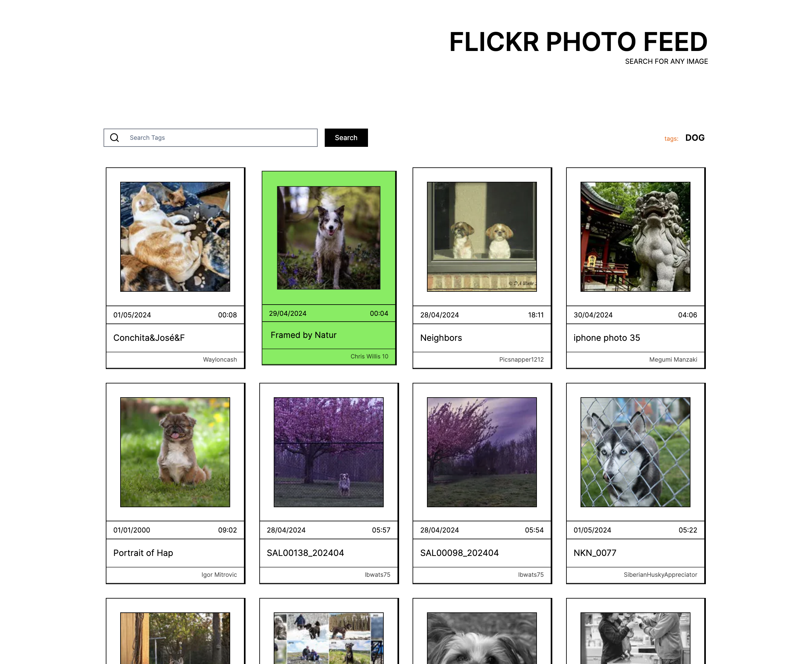

# Flickr Feed App

## Overview

This web application allows users to browse public Flickr feed images in either a list or grid view. Additionally, users can search for images using keywords/tags and view relevant results.

### Features:

- Loads public feed images on page load
- Allows users to search for images using keywords/tags
- Displays images in a visually appealing format with modern brutal styling
- Provides hover animations for interactivity

## Technologies Used

-TypeScript
- Next.js
- Modern brutal styling
- Framer Motion for hover animations

## Search Functionality

1. Enter a keyword in the search box.
2. Click on the search button.
3. Relevant images with the entered keyword/tags will be displayed.

## Additional Information

- The application uses Next.js for routing and client-side rendering.
- Interactivity is enhanced with Framer Motion for smooth hover animations.
- The application includes error handling for failed API requests.

